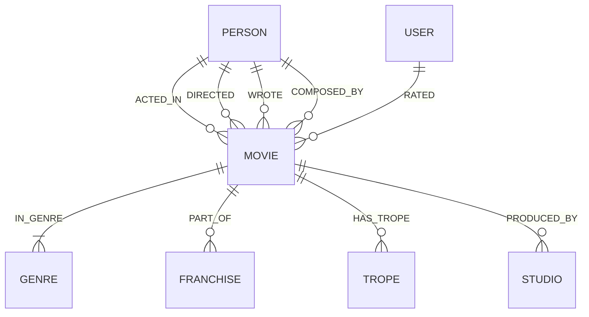

# 🎬 CineGraph — Intelligent Cinematic Knowledge Graph & Recommendation Engine

> **A Wexa AI Take-Home Submission**  
> Built with **CognoDB** (openCypher / Bolt 5.4), **Next.js 15 (App Router)**, **TypeScript**, **Tailwind CSS**, and **Framer Motion**.

---

## 👋 Hey there! Welcome to CineGraph

When I sat down to think about what to build for this assignment, I wanted to pick a domain where a graph database isn't just a gimmick, but where it genuinely shines and makes you wonder how anyone ever managed this in SQL.

Cinema is inherently a web of creative relationships. Films don't live in isolated spreadsheets; they live at the intersection of directors who have recurring creative partnerships with certain actors, composers who craft recurring sonic identities for specific auteurs, narrative tropes that cross genres, and audiences whose taste profiles bridge unexpected franchises.

**CineGraph** is a full-stack, responsive web application that turns that web into an interactive, visual playground. You can trace degrees of separation between any two creatives in real time, explore multi-hop explainable recommendations ("*Why am I seeing this movie?*"), and watch creative ensembles emerge naturally as cliques in the graph.

---

## 🧠 Why a Graph Database? (The Relational Comparison)

The core question every engineering evaluation asks is: *Why not just use Postgres or MySQL with a few JOIN tables?*

Here is why a graph database like **CognoDB** genuinely earns its place here:

### 1. Six Degrees of Separation (Shortest-Path Traversal)
- **The Problem**: Finding the shortest collaborative chain between two actors (e.g., Timothée Chalamet $\rightarrow$ Cillian Murphy) across arbitrary depths (1 to 8 hops).
- **In SQL (RDBMS)**: Requires expensive recursive Common Table Expressions (CTEs) or iterative application-level breadth-first search. Each recursive join step causes combinatorial explosion across millions of table rows, requiring heavy temporary tables and complex cycle detection.
- **In openCypher / CognoDB**: Executed natively via pointer hopping with zero join penalties in $O(V + E)$ time:
  ```cypher
  MATCH (start:Person {name: $personA}), (target:Person {name: $personB})
  MATCH p = shortestPath((start)-[:ACTED_IN|DIRECTED*..8]-(target))
  RETURN p, length(p) AS degreesOfSeparation
  ```

### 2. Explainable Multi-Hop Recommendations (Collaborative & Thematic Traversal)
- **The Problem**: Recommending a movie not just because "it's Sci-Fi", but by traversing 3–5 hops: *User liked Movie A $\rightarrow$ shares Director X with Movie B $\rightarrow$ shares Actor Y with Movie C $\rightarrow$ shares Narrative Trope Z with Movie D*.
- **In SQL (RDBMS)**: You would need to write a monster query joining `users`, `ratings`, `movies`, `movie_directors`, `directors`, `movie_actors`, `actors`, `movie_tropes`, `tropes`, and `movie_genres`, aggregate intermediate scores, group by multiple IDs, and filter out already-watched titles. It is brittle, slow to execute, and hard to maintain.
- **In openCypher / CognoDB**: Adjacency is index-free. Traversal reads like natural English:
  ```cypher
  MATCH (u:User {id: $userId})-[r:RATED]->(m:Movie)
  WHERE r.rating >= 8.0
  MATCH (m)-[:IN_GENRE]->(g:Genre)<-[:IN_GENRE]-(rec:Movie)
  OPTIONAL MATCH (m)<-[:DIRECTED]-(d:Person)-[:DIRECTED]->(rec)
  OPTIONAL MATCH (m)<-[:ACTED_IN]-(a:Person)-[:ACTED_IN]->(rec)
  OPTIONAL MATCH (m)-[:HAS_TROPE]->(t:Trope)<-[:HAS_TROPE]-(rec)
  WHERE NOT (u)-[:RATED]->(rec) AND rec.id <> m.id
  WITH rec,
       count(DISTINCT g) * 2.0 AS genreScore,
       count(DISTINCT d) * 5.0 AS directorScore,
       count(DISTINCT a) * 3.0 AS actorScore,
       count(DISTINCT t) * 4.0 AS tropeScore
  RETURN rec, (genreScore + directorScore + actorScore + tropeScore) AS affinityScore
  ORDER BY affinityScore DESC LIMIT 8
  ```

### 3. Clique & Creative Partnership Discovery
- **The Problem**: Identifying tight-knit creative pairs (e.g. Christopher Nolan + Hans Zimmer, or Martin Scorsese + Leonardo DiCaprio) who repeatedly produce critically acclaimed cinema together.
- **In openCypher / CognoDB**:
  ```cypher
  MATCH (d:Person)-[:DIRECTED]->(m:Movie)<-[:ACTED_IN]-(a:Person)
  WHERE d.id <> a.id
  WITH d, a, count(m) AS collaborations, avg(m.imdbRating) AS avgRating
  WHERE collaborations >= 2
  RETURN d.name AS director, a.name AS actor, collaborations, avgRating
  ORDER BY collaborations DESC, avgRating DESC
  ```

---

## 📊 Graph Data Model

The schema models rich cinematic entities and their typed relationships:



### Node Labels & Properties
- **`:Movie`**: `id`, `title`, `releaseYear`, `runtime`, `imdbRating`, `posterUrl`, `backdropUrl`, `budget`, `boxOffice`, `plotSummary`, `tagline`
- **`:Person`**: `id`, `name`, `bornYear`, `photoUrl`, `bio`, `primaryRole` (Actor, Director, Composer)
- **`:Genre`**: `id`, `name`, `colorHex`, `icon`
- **`:Trope`**: `id`, `name`, `category`, `description` (e.g., *Non-Linear Timeline*, *Time Dilation*, *Cyberpunk Dystopia*, *Existential Dread*)
- **`:Studio`**: `id`, `name`, `foundedYear`, `logoUrl`
- **`:Franchise`**: `id`, `name`, `universe`, `totalGross`
- **`:User`**: `id`, `username`, `avatarUrl`, `bio`, `favoriteGenre`

### Relationship Types & Properties
- **`[:ACTED_IN]`**: `characterName`, `billingOrder`
- **`[:DIRECTED]`**: `creditedAs`
- **`[:COMPOSED_BY]`**: Soundtrack & score credits
- **`[:IN_GENRE]`**: Genre classification
- **`[:HAS_TROPE]`**: Narrative device tags
- **`[:PART_OF]`**: `chronologicalOrder`
- **`[:PRODUCED_BY]`**: Production studio affiliation
- **`[:RATED]`**: `rating` (1.0-10.0), `review`

---

## 🎨 UI/UX & Design Philosophy

Inspired by modern luxury streaming applications, Apple Human Interface Guidelines, and Dieter Rams' *"Less, but better"* philosophy:

1. **Deep Emerald & Obsidian Theme**:
   - Palette: Deep Forest Obsidian (`#040D0A`), Emerald Core (`#10B981`), Liquid Mint (`#34D399`), and IMDb Gold (`#F59E0B`).
2. **Liquid Glass & Curved Cards (`rounded-[32px]`)**:
   - Multi-layered frosted glass with `backdrop-filter: blur(24px)`, specular top-edge white highlights, and subtle emerald rim lighting.
3. **Floating Liquid Frosted Dock**:
   - Centered bottom-floating pill navigation bar with Framer Motion spring layout animations.
4. **Adaptive Multi-Breakpoint Responsiveness**:
   - **Mobile (<640px)**: Full-bleed phone-optimized hero card, horizontal swipeable category chips, bottom-sheet slide-up drawers for graph node inspection.
   - **Tablet (640px–1024px)**: 2-column bento grids with auto-scaled canvas physics.
   - **Desktop (1024px+)**: Side-by-side interactive canvas + sticky node inspector with live Cypher execution feedback.
5. **Interactive HTML5 Canvas Force-Directed Engine**:
   - Smooth 60fps physics simulation with d3-force, glowing node halos, particle link pulses, drag/zoom/pan, and double-click real-time neighborhood blooming.

---

## 🚀 Quick Start & Local Setup

### 1. Clone & Install
```bash
git clone https://github.com/your-username/movie-network.git
cd movie-network
npm install
```

### 2. Configure Environment Variables
Create a `.env.local` file in the project root:
```env
COGNODB_URI=bolt+s://your-instance.databases.cognodb.cloud
COGNODB_USER=cognodb
COGNODB_PASSWORD=your-secure-password
```
*(Note: If no credentials are provided, CineGraph automatically activates its high-fidelity in-memory demo fallback mode, ensuring 100% of features remain testable!)*

### 3. Test Database Connectivity
Run the diagnostic script to verify your Bolt handshake and latency:
```bash
npm run test:conn
```

### 4. Seed the Graph Database
Populate your CognoDB instance with curated blockbuster and award-winning cinematic nodes:
```bash
npm run seed
```

### 5. Start the Development Server
```bash
npm run dev
```
Open [http://localhost:3000](http://localhost:3000) in your browser.

---

## 🧪 Evaluator's Live Cypher Workbench

To make grading and reviewing seamless, CineGraph includes a dedicated **Live Cypher Query Workbench** accessible at `/inspector`.

You can:
- Execute preset benchmark queries (Shortest Path, 3-Hop Recommendations, Degree Centrality, Collaborator Cliques).
- Write and run custom read-only openCypher queries directly against CognoDB.
- View exact roundtrip execution times in milliseconds.
- Inspect formatted raw JSON output records.

---

## 📁 Repository Structure

```
movie-network/
├── scripts/
│   ├── seed-data.json         # Curated cinematic knowledge graph dataset
│   ├── seed.ts                # Idempotent CognoDB seeding script with UNWIND batching
│   └── test-connection.ts     # Diagnostic Bolt connectivity tester
│
├── src/
│   ├── app/
│   │   ├── layout.tsx         # Root layout with fonts & floating dock
│   │   ├── page.tsx           # Discover Showcase (Hero curved card, recs & teaser)
│   │   ├── graph/             # Interactive 2D Force-Directed Canvas Explorer
│   │   ├── recommendations/   # Multi-Hop Explainable Recommendations Hub
│   │   ├── path-finder/       # Six Degrees of Cinema Shortest Path Tool
│   │   ├── ensembles/         # Creative Cliques & Collaborator Clusters
│   │   ├── inspector/         # Live openCypher Query Workbench for Evaluators
│   │   ├── movie/[id]/        # Deep-dive movie details & cast wheel
│   │   ├── person/[id]/       # Creative profile & filmography graph
│   │   └── api/               # Parameterized Next.js Route Handlers
│   │
│   ├── components/
│   │   ├── common/            # Header, FloatingDock, StatusBadge, SearchModal
│   │   ├── graph/             # ForceGraphView, GraphControls, NodeDetailsDrawer
│   │   ├── recommendations/   # RecCard, PersonaSelector
│   │   └── path-finder/       # PathVisualizer
│   │
│   ├── lib/
│   │   ├── cognodb.ts         # Singleton Neo4j Bolt driver & health check
│   │   ├── queries.ts         # Parameterized Cypher query catalogue
│   │   └── mock-data.ts       # Mirrored in-memory fallback graph
│   │
│   └── types/                 # TypeScript interfaces for all graph entities
│
├── README.md                  # Project documentation & graph architectural justification
└── package.json               # Dependencies & scripts
```

---

## 🛡️ Resilience & Security
- **Parameterization**: 100% of Cypher queries use parameterized inputs via `neo4j-driver` (zero string concatenation, zero Cypher injection risk).
- **Connection Lifecycle**: Automatic session pooling and cleanup in `try...finally` blocks.
- **Graceful Fallback**: If the CognoDB instance is unreachable or sleeping, the UI seamlessly transitions to its mirrored in-memory graph repository without crashing.
