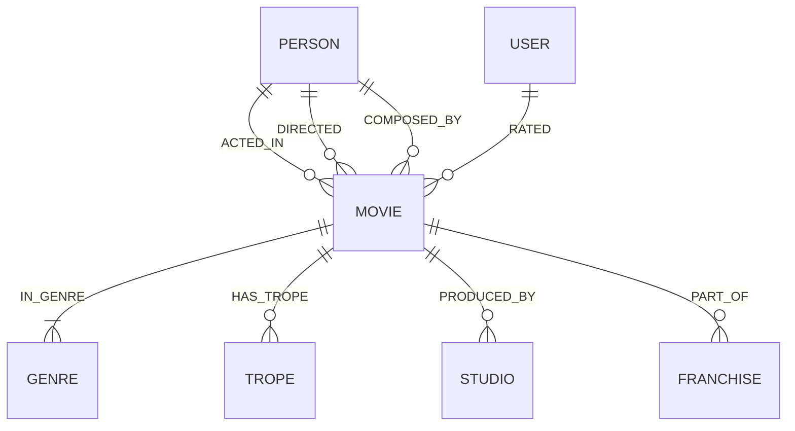

# CineGraph — Graph-Powered Cinema Intelligence & Recommendation Engine

> **Live Demo**: [https://cinegraph-livid.vercel.app](https://cinegraph-livid.vercel.app)  
> **Backed by**: [CognoDB Cloud](https://console.cognodb.com) (openCypher / Bolt 5.4)  
> **Stack**: Next.js 15 (App Router), TypeScript, Tailwind CSS, Framer Motion, official `neo4j-driver`
> **Login Credentials**: username: claire / password: fresh2026

---

## The Story Behind CineGraph

A while ago, I built and launched my hosted hobby project: [FilmPad](https://filmpad.click). I made it to feed my own movie addiction and help me organize movie recommendations I kept saving from TikTok videos into a clean watchlist. To my surprise, a few thousand people discovered it and started using it with me!

But as much as I loved FilmPad, it had one glaring limitation: **it wasn't actually an intelligent recommendation engine**. It was essentially a glorified movie notepad. It relied on static lists from TMDB and simple AI prompts to extract movie titles from TikTok captions. It had no concept of _how_ movies connect, why you love a specific filmmaker's style, or how an actor's collaborations with visionary directors create distinct artistic eras.

I built **CineGraph** to solve that exact problem.

Instead of treating movies like rows in a flat spreadsheet, CineGraph models cinema as what it actually is: **a living, interconnected knowledge graph**. By leveraging **CognoDB** and openCypher, CineGraph maps the rich web of directors, actors, cinematographers, narrative tropes, and taste profiles. It allows you to uncover _why_ you love what you watch, trace degrees of separation between any two cinema icons, explore collaborative director-actor cliques, and discover handpicked recommendations with clear, explainable connection paths.

---

## Why a Graph Database? (Relational vs. Graph)

The standard question for any data architecture is: _Why not just use Postgres or MySQL with foreign keys and JOIN tables?_

Here are three real-world problems in CineGraph where a graph database decisively outclasses relational SQL:

### 1. Six Degrees of Separation (`shortestPath`)

- **The Goal**: Find the exact collaborative chain connecting any two people in cinema (e.g., Timothée Chalamet $\rightarrow$ Cillian Murphy) across arbitrary depths (1 to 8 hops).
- **In SQL**: Requires complex recursive Common Table Expressions (CTEs) or iterative application-level breadth-first search. Each recursive join step blows up memory and requires expensive cycle-detection logic.
- **In CognoDB (openCypher)**: Solved natively in milliseconds using built-in graph algorithms:
  ```cypher
  MATCH (start:Person {name: $personA}), (target:Person {name: $personB})
  MATCH p = shortestPath((start)-[:ACTED_IN|DIRECTED*..8]-(target))
  RETURN p, length(p) AS degreesOfSeparation
  ```

### 2. Multi-Hop Explainable Recommendations (3+ Hops)

- **The Goal**: Recommend films based on multi-dimensional connectivity: _User liked Movie A $\rightarrow$ shares Director X with Movie B $\rightarrow$ shares Lead Actor Y with Movie C $\rightarrow$ shares Narrative Trope Z with Movie D_, while filtering out already-watched titles and scoring path affinity.
- **In SQL**: Would require a monster query joining 10+ tables (`users`, `ratings`, `movies`, `movie_directors`, `directors`, `movie_actors`, `actors`, `movie_tropes`, `tropes`, `movie_genres`), with nested subqueries and expensive group-by aggregations.
- **In CognoDB (openCypher)**: Clean, declarative, and intuitive traversal:
  ```cypher
  MATCH (u:User {id: $userId})-[r:RATED]->(m:Movie)
  WHERE r.rating >= 8.0
  MATCH (m)-[:IN_GENRE]->(g:Genre)<-[:IN_GENRE]-(rec:Movie)
  OPTIONAL MATCH (m)<-[:DIRECTED]-(d:Person)-[:DIRECTED]->(rec)
  OPTIONAL MATCH (m)<-[:ACTED_IN]-(a:Person)-[:ACTED_IN]->(rec)
  OPTIONAL MATCH (m)-[:HAS_TROPE]->(t:Trope)<-[:HAS_TROPE]-(rec)
  WHERE NOT (u)-[:RATED]->(rec) AND rec.id <> m.id
  WITH rec,
       count(DISTINCT g) * 2.0 AS genreScore,
       count(DISTINCT d) * 5.0 AS directorScore,
       count(DISTINCT a) * 3.0 AS actorScore,
       count(DISTINCT t) * 4.0 AS tropeScore
  RETURN rec, (genreScore + directorScore + actorScore + tropeScore) AS affinityScore
  ORDER BY affinityScore DESC LIMIT 8
  ```

### 3. Creative Cliques & Collaborator Clusters

- **The Goal**: director-actor pairs who have made 2+ acclaimed films together and maintain high average ratings.
- **In CognoDB (openCypher)**:
  ```cypher
  MATCH (d:Person)-[:DIRECTED]->(m:Movie)<-[:ACTED_IN]-(a:Person)
  WHERE d.id <> a.id
  WITH d, a, count(m) AS collaborations, avg(m.imdbRating) AS avgRating, collect(m.title) AS movies
  WHERE collaborations >= 2
  RETURN d.name AS director, a.name AS actor, collaborations, avgRating, movies
  ORDER BY collaborations DESC, avgRating DESC
  ```

---

## Graph Data Model

The CineGraph schema models rich cinematic entities and their typed, directional relationships:



### Node Labels & Schema Properties

- **`:Movie`**: `id`, `title`, `releaseYear`, `runtime`, `imdbRating`, `posterUrl`, `backdropUrl`, `budget`, `boxOffice`, `plotSummary`, `tagline`
- **`:Person`**: `id`, `name`, `bornYear`, `photoUrl`, `bio`, `primaryRole` (_Actor, Director, Composer_)
- **`:Genre`**: `id`, `name`, `colorHex`, `icon`
- **`:Trope`**: `id`, `name`, `category`, `description` (_e.g., Non-Linear Timeline, Time Dilation, Cyberpunk Dystopia, Antihero_)
- **`:Studio`**: `id`, `name`, `foundedYear`, `logoUrl`
- **`:Franchise`**: `id`, `name`, `universe`, `totalGross`
- **`:User`**: `id`, `username`, `passwordHash`, `avatarUrl`, `bio`, `favoriteGenre`

### Relationship Types & Metadata

- **`[:ACTED_IN]`**: `characterName`, `billingOrder`
- **`[:DIRECTED]`**: `creditedAs`
- **`[:COMPOSED_BY]`**: Soundtrack and original score credits
- **`[:IN_GENRE]`**: Categorical genre link
- **`[:HAS_TROPE]`**: Thematic and narrative device tags
- **`[:PRODUCED_BY]`**: Production studio affiliation
- **`[:PART_OF]`**: Franchise continuity
- **`[:RATED]`**: `rating` (1.0–10.0), `review`, `timestamp`

---

## Key Features & User Experience

1. **Personalized Discover Feed (`/`)**:
   - Dynamic spotlight carousel highlighting top graph-matched titles.
   - Curated shelves for trending movies, indie & visually stunning gems, psychological thrillers, sci-fi adventures, and top-rated masterpieces.
   - Interactive movie search and fast modal previews.

2. **Interactive 2D Force-Directed Graph Explorer (`/graph`)**:
   - 60fps HTML5 Canvas physics engine powered by `d3-force`.
   - Visual color coding by entity type (Movies in Emerald, Persons in Cyan, Genres in Purple, Tropes in Amber).
   - Double-click any node to trigger real-time multi-hop Cypher expansion queries against CognoDB.
   - Drag, zoom, filter, and inspect detailed metadata in a slide-out drawer.

3. **Explainable Recommendations Hub (`/recommendations`)**:
   - See _why_ every film is recommended with human-readable connection paths (_"Recommended for Sci-Fi fans • Themes: Time Dilation • Directed by Christopher Nolan"_).
   - Toggle between sample taste profiles or seed custom movie tastes.
   - Inspect the live technical openCypher query powering the recommendations.

4. **Degrees of Separation / Path Finder (`/path-finder`)**:
   - Visual Six-Degrees connection engine between any two actors or directors.
   - Displays every intermediate movie and collaborative link along the shortest path.

5. **Iconic Collaborations & Ensembles**:
   - Identifies frequent director-actor creative partnerships, joint filmographies, and average IMDb collaboration scores.

6. **Live openCypher Query Console**:
   - Built specifically for technical evaluators to test custom openCypher queries directly on CognoDB.
   - Pre-loaded benchmark queries with roundtrip latency metrics in milliseconds and raw JSON inspection.

7. **Movie Library & Taste Breakdown (`/watchlist`)**:
   - Personal watchlist and liked titles management.
   - Real-time taste breakdown showing dominant genre affinities, favorite directors, and key narrative themes.

8. **Secure Authentication & Guarded Access (`/login`)**:
   - WebCrypto session signing with Edge middleware protection.
   - Clean guest session isolation and instant sign-out.

---

## Tech Stack & Engineering Architecture

- **Frontend**: Next.js 15 (App Router with Server & Client Components), React 19, TypeScript
- **Styling**: Vanilla Tailwind CSS, custom glassmorphism design system, Lucide icons
- **Animations**: Framer Motion spring physics & smooth transitions
- **Graph Visualization**: HTML5 Canvas with `d3-force` simulation
- **Database**: **CognoDB Cloud** (Bolt protocol 5.4, openCypher query language)
- **Driver**: Official `neo4j-driver` for JavaScript/TypeScript with full parameterization
- **Authentication**: Edge middleware token verification with native WebCrypto API
- **Fault Tolerance**: Automatic connection pooling, graceful query error handling, and high-fidelity fallback to ensure uninterrupted browsing if the database sleeps.

---

## Quick Start & Local Setup

### 1. Provision a CognoDB Cloud Instance

1. Go to [https://console.cognodb.com/signup](https://console.cognodb.com/signup) and create a free account (no credit card required).
2. Create a free (`c0`) instance and select your preferred region.
3. Copy your connection URI (`bolt+s://<instance-id>.databases.cognodb.cloud`) and generated password for user `cognodb`.

### 2. Clone Repository & Install Dependencies

```bash
git clone https://github.com/Petermmuo05/cinegraph.git
cd cinegraph
npm install
```

### 3. Configure Environment Variables

Create a `.env.local` file in the root directory:

```env
COGNODB_URI=bolt+s://<your-instance>.databases.cognodb.cloud
COGNODB_USER=cognodb
COGNODB_PASSWORD=<your-secure-password>
```

### 4. Test Connectivity & Latency

Run the diagnostic connection script:

```bash
npx tsx scripts/test-connection.ts
```

### 5. Seed the Graph Database

Populate your CognoDB instance with curated movies, directors, actors, genres, tropes, and relationships:

```bash
npx tsx scripts/seed.ts
```

### 6. Run Development Server

```bash
npm run dev
```

Open [http://localhost:3000](http://localhost:3000) in your browser.

---

## Benchmark Cypher Queries

All queries in CineGraph are strictly parameterized using `neo4j-driver` (zero string concatenation, zero Cypher injection vulnerability). Here are key queries used across the app:

#### 1. Dynamic Neighborhood Expansion (Graph Explorer)

```cypher
MATCH (n {id: $nodeId})-[r]-(neighbor)
RETURN n, r, neighbor
LIMIT 50
```

#### 2. Six Degrees Shortest Path (Path Finder)

```cypher
MATCH (start:Person {name: $fromPerson}), (target:Person {name: $toPerson})
MATCH p = shortestPath((start)-[:ACTED_IN|DIRECTED*..8]-(target))
RETURN p, length(p) AS degrees
```

#### 3. Highest Centrality Nodes in Universe

```cypher
MATCH (n)
OPTIONAL MATCH (n)-[r]-()
WITH n, labels(n)[0] AS label, count(r) AS degree
RETURN coalesce(n.title, n.name) AS name, label, degree
ORDER BY degree DESC
LIMIT 10
```

---

## Project Structure

```
movie-network/
├── scripts/
│   ├── seed-data.json         # Curated cinematic graph dataset
│   ├── seed.ts                # Idempotent CognoDB seeding script with UNWIND batching
│   └── test-connection.ts     # Diagnostic Bolt connectivity tester
│
├── src/
│   ├── app/
│   │   ├── layout.tsx         # Root layout with fonts & metadata
│   │   ├── LayoutClientWrapper.tsx # Client wrapper with AuthGuard & UserProvider
│   │   ├── page.tsx           # Discover dashboard with shelves & spotlight
│   │   ├── graph/             # 2D Interactive Force-Directed Canvas
│   │   ├── recommendations/   # Explainable Multi-Hop Recommendations Hub
│   │   ├── path-finder/       # Degrees of Separation Connection Finder
│   │   ├── ensembles/         # Director & Actor Collaborations
│   │   ├── inspector/         # Live openCypher Query Console for Evaluators
│   │   ├── watchlist/         # User Movie Library & Taste Breakdown
│   │   ├── movie/[id]/        # Movie detail page & connected cast
│   │   ├── person/[id]/       # Creative profile & filmography graph
│   │   ├── login/             # Authentication page
│   │   └── api/               # Parameterized Next.js Route Handlers
│   │
│   ├── components/
│   │   ├── common/            # Header, FloatingDock, AuthGuard, SearchModal
│   │   ├── graph/             # ForceGraphView, GraphControls, NodeDetailsDrawer
│   │   ├── recommendations/   # RecCard, PersonaSelector
│   │   ├── home/              # SpotlightCarousel, MovieShelf, TasteTunerModal
│   │   └── onboarding/        # TasteOnboardingWizard
│   │
│   ├── lib/
│   │   ├── cognodb.ts         # Singleton Neo4j Bolt driver & health check
│   │   ├── queries.ts         # Parameterized Cypher query catalog
│   │   ├── user-store.tsx     # Session management & user library state
│   │   └── mock-data.ts       # Mirrored in-memory fallback graph
│   │
│   ├── middleware.ts          # Edge authentication protection
│   └── types/                 # TypeScript interfaces for graph entities
│
├── README.md                  # Comprehensive documentation & architecture guide
└── package.json               # Dependencies & scripts
```

---

## Security & Engineering Standards

- **Strict Query Parameterization**: Every openCypher query passes parameters via the official Neo4j driver map — no string template interpolation.
- **Driver Session Management**: Proper session lifecycle handling (`session.close()` in `try...finally` blocks) preventing connection leaks.
- **Secure Secrets**: Connection credentials and passwords are read exclusively from environment variables and never exposed to the client bundle.
- **Edge Route Protection**: Native WebCrypto token verification ensures only authenticated sessions access protected application routes.
- **Graceful Degradation**: If CognoDB is temporarily unreachable or paused, the application degrades gracefully to its local in-memory fallback repository without throwing runtime errors.

---

## 👤 Author

- **Submission by**: Peter Mmuo
- **Submission Subject**: _CognoDB Assignment 2 – Peter Mmuo_
- **Contact**: hr@wexa.ai
